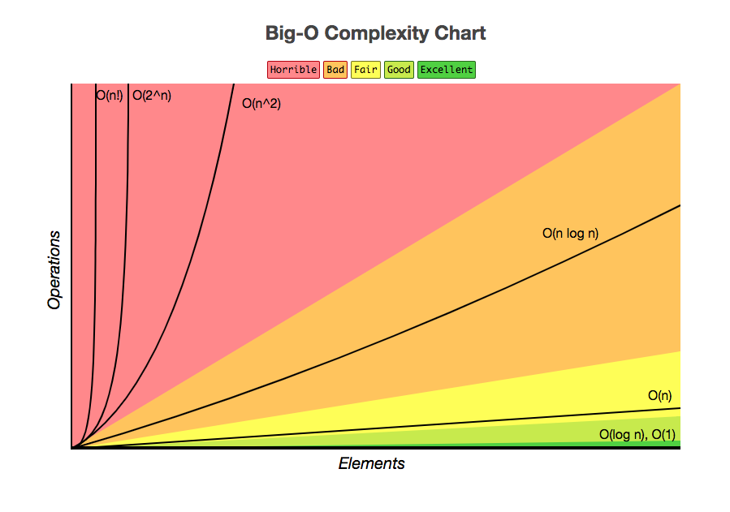

## What is Big O Notation?

 - Big O notation is used in computer science to describe the performance or complexity of an algorithm. Big O specifically describes the worst-case scenario, and can be used to describe the execution time required or the space used by an algorithm. 
 - It is hard to pin down the exact runtime required by an algorithm, it depends on what processor you use, what other programs the computer is running. 
 - So instead of calculating that, we use a concept to see how quickly the runtime grows. Imagine when we write a piece of code, we would more likely end up in refactoring it not just because we want to keep the application DRY, but we want to make sure the efficiency of our code, which is directly related to user experience.

## Making Sense of Big O Notation
Before any example, here are some concepts you need to know first:

Size of input: we call it “n”. So we can say things like, we have a function which takes a parameter of an array of integers. Then the input here refers to the array.
The rules: In big O analysis, it only cares about the code that grows the fastest as the input grows, because everything else eclipsed(big O analysis is also called asymptotic analysis).
Now let’s take a look at the examples:

In this function, the n is 10. We can change the length of it.

```js
array = [1,2,3,4,5,6,7,8,9,10];
function sum(array) {
  var total = 0;
  array.forEach(num => {
  total += num
   });
 return total 
}
//=> 55
```
If we run enough time using different size of input, we can get their runtime:


It’s obvious that the runtime grows linearly as the n grows. This is called a linear time. Mathematically, it is expressed as T = an + b.

Remember in the rules we mentioned Big O only cares about the part where it grows the fastest? So we first find that part ( an )and secondly take out the coefficient( a), we are left with n, and that’s O(n).

There are different types of time complexity:

Linear Time (example above) => O(n)
Constant Time (runtime doesn’t change whatever the input is) => O(1)
Quadratic Time(the time it takes to complete a function increase like a quadratic function) => O(n²)
## Big-O Complexity Chart

 - The following show time coplexity from best to worst

 

 ------

_If you spot any bugs or issues in this activity, you can [open an issue with your proposed change](https://github.com/Dagic-zewdu/algorithm-practice/issues)._