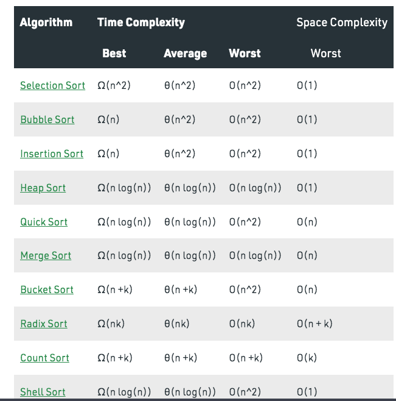

The efficiency of an algorithm depends on two parameters:

   1. Time Complexity
   2. Space Complexity

**Time Complexity**: Time Complexity is defined as the number of times a particular instruction set is executed rather than the total time taken. It is because the total time took also depends on some external factors like the compiler used, processor’s speed, etc.

**Space Complexity**: Space Complexity is the total memory space required by the program for its execution.

Both are calculated as the function of input size(n).

One important thing here is that in spite of these parameters the efficiency of an algorithm also depends upon the nature and size of the input. 

**Types Of Time Complexity :**

**Best Time Complexity**: Define the input for which algorithm takes less time or minimum time. In the best case calculate the lower bound of an algorithm. Example: In the linear search when search data is present at the first location of large data then the best case occurs.
Average Time Complexity: In the average case take all random inputs and calculate the computation time for all inputs.
And then we divide it by the total number of inputs.
Worst Time Complexity: Define the input for which algorithm takes a long time or maximum time. In the worst calculate the upper bound of an algorithm. Example: In the linear search when search data is present at the last location of large data then the worst case occurs.

  - Following is a quick revision sheet that you may refer to at the last minute

